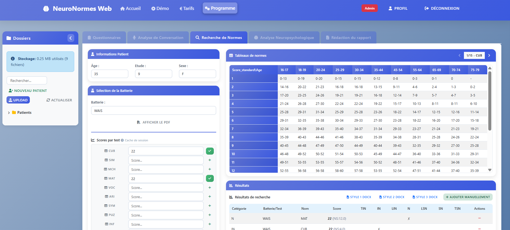
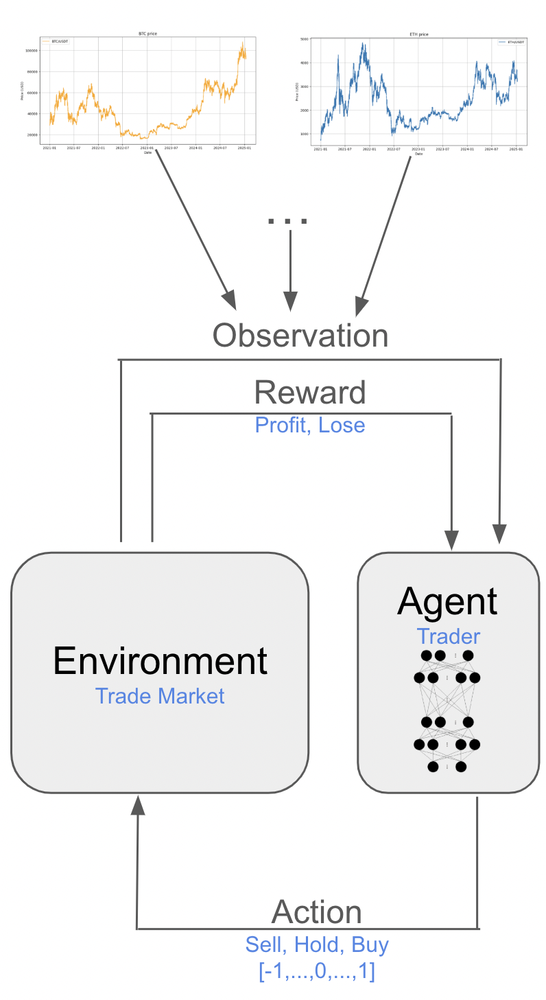
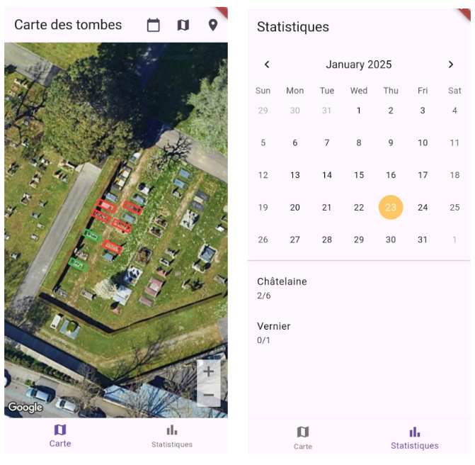
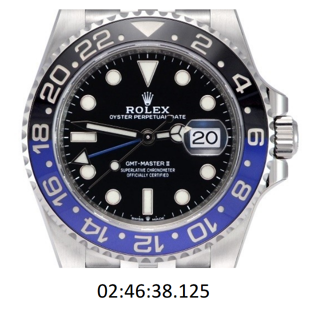
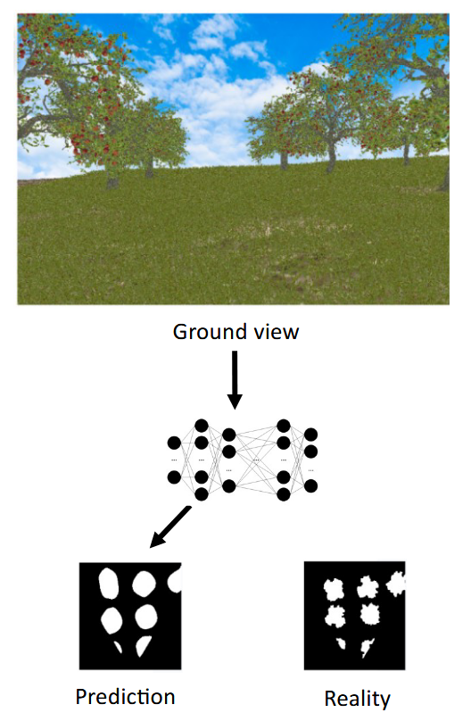
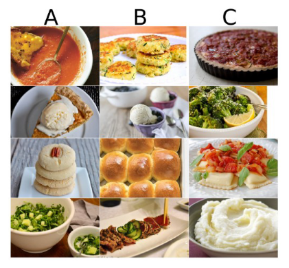
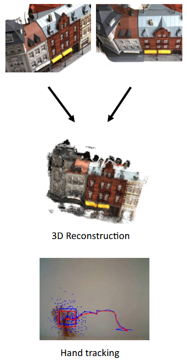
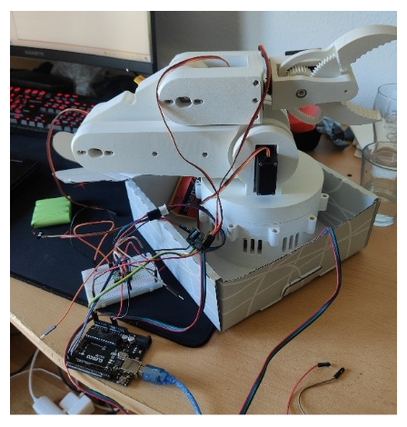
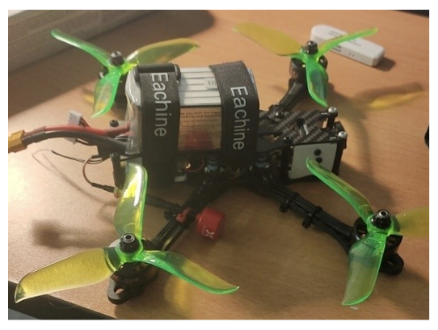

# Simon Rumley  
### Machine Learning & Robotics Engineer (ETH Zürich & EPFL)

I build intelligent systems in **robotics**, **reinforcement learning**, **computer vision**, and **AI-driven automation**.  
My work spans real-world ML deployments, full-stack AI products, and applied research for industry.

---

## About Me

- **Master in Robotics/Mechanical engineering – ETH Zurich**  
  Focus on ML, optimal control, computer vision & autonomous systems.

- **Machine Learning / AI Engineer**  
  Experience in RL, CV, NLP/RAG, robotics, and simulation.

- **Industry & Freelance**  
  Worked with **Gravis Robotics**, **Rolex**, and clients in legal automation & neuropsychology.

- Based in Geneva, Switzerland.

---

# Featured Projects

---

## Neuropsychology Analysis Automation  
**Neuronormes – Geneva**  
06/2025 – Today

| Description | Image |
|------------|-------|
| Developed a full-stack clinical web application for automated neuropsychological assessment and report generation. Features include psychometric norm database search, real-time data visualization, audio transcription, conversation analysis, and AI-powered report generation with integrated GPT chatbot assistance. Front-end development was assisted by **GitHub Copilot** and **Cursor** for faster prototyping and implementation.    **Tech:** Flask, MongoDB, Azure Container Apps, OpenAI GPT-4, Whisper API, Python (Pandas, NumPy), python-docx, React, Docker |  |

---

## Swiss Legal Texts Processing  
**Freelance – Geneva**  
05/2025 – 07/2025

| Description | Image |
|------------|-------|
| Implemented a Retrieval-Augmented Generation (RAG) pipeline for Swiss legal documents. The system parses, summarizes, and indexes legal decisions using GPT models combined with strict JSON schemas. Web scraping was performed to collect the legal texts. Chroma/HuggingFace embeddings were used for vector search, enabling fast and accurate retrieval of relevant cases.    **Tech:** Python, GPT APIs, ChromaDB, LangChain |  |

---

## RL for Cryptocurrency Trading  
**Freelance – Asia, Remote**  
09/2024 – 05/2025

| Description | Image |
|------------|-------|
| Built an RL-based cryptocurrency trading pipeline. Responsibilities included data collection and preprocessing, PPO agent training, hyperparameter tuning, backtesting, and risk evaluation. The project focused on creating an adaptable system capable of trading multiple cryptocurrencies automatically.    **Tech:** Python, TensorFlow, Stable-Baselines3, Binance API |  |

---

## Application Development – Plant Watering App  
**Ethenoz & Cie – Geneva**  
09/2024 – 05/2025

| Description | Image |
|------------|-------|
| Created a mobile app to manage plant watering schedules in cemeteries with real-time Firebase sync. Users can mark graves as watered directly on a map interface. Bluetooth and GPS were initially tested; a new study using UWB components is ongoing to reduce manual work for gardeners. Front-end development leveraged **Copilot** and **Cursor** to accelerate UI implementation.    **Tech:** React Native, Firebase, JS |  |

---

## Master’s Thesis – Excavation Automation using RL  
**Gravis – Zurich**  
10/2023 – 04/2024

| Description | Image |
|------------|-------|
| Developed a reinforcement learning control policy generalized across multiple excavator models. Tasks included physics-based simulation setup, scalable RL training, CI/CD integration, and testing in real-world scenarios. This allowed for automated excavation planning with minimal human intervention.    **Tech:** Python, RL, Gym, Isaac Gym, ROS |  |

---

## Internship – Computer Vision Project Manager  
**Rolex – Geneva**  
02/2023 – 08/2023

| Description | Image |
|------------|-------|
| Developed deep learning and image processing solutions for precision watch component analysis. Managed the complete project lifecycle from planning to implementation. Presented progress and results during internal meetings.    **Tech:** Python, PyTorch, OpenCV |  |

---

## Computer Vision for Agriculture – Tree Detection & Aerial Reconstruction  
**Unity3D & V4RL – ETH Zurich**  
10/2022 – 03/2023

| Description | Image |
|------------|-------|
| Estimated the location of trees in an orchard using ground-based cameras and AI to reconstruct aerial views. Developed an algorithm generating multiple virtual orchard configurations and configured camera navigation for capturing image pairs. A neural network was trained on these pairs to predict aerial views from ground perspectives. A scientific paper was published at ICRA ([PDF](https://imrclab.github.io/workshop-uav-sims-icra2023/papers/RS4UAVs_paper_9.pdf)).    **Tech:** Python, C++, OpenCV, PyTorch |  |

---

# Student Projects

---

## Machine Learning Projects (ETH)  
02/2022 – 05/2022

| Description | Image |
|------------|-------|
| Implemented various ML projects, including ICU patient outcome prediction, food taste similarity prediction, and organic solar-cell material discovery. Focus was on end-to-end model design, feature engineering, and performance evaluation.    **Tech:** Python, Sklearn, PyTorch |  |

---

| Description | Image |
|------------|-------|
| Developed computer vision algorithms covering:  - Feature extraction: Harris detector, SIFT, HoG  - Classification: digit classifier, Bag-of-Words, CNN classifier  - Segmentation: Mean-Shift, simplified SegNet  - 3D reconstruction: camera calibration, Structure from Motion, Multi-View Stereo  - Object tracking    **Tech:** Python, OpenCV |  |

---

# Other Technical Projects

---

## Robotic Arm – Designed & Built

| Description | Image |
|------------|-------|
| Designed and built a 3D-printed robotic arm. Tasks included component selection and compatibility studies, assembly and wiring, and programming servos with Arduino for motion control. Applied knowledge from the Robot Dynamics course to create a functional robotic system.    **Tech:** Arduino, 3D Printing, C++ |  |

---

## FPV Racing Quadcopter Build

| Description | Image |
|------------|-------|
| Built a custom FPV drone. Responsibilities included component selection, assembly, soldering peripherals, 3D printing custom parts, and programming/configuring the drone with Betaflight. Focus was on optimizing flight stability and performance for racing applications.    **Tech:** Betaflight, 3D Printing, Soldering |  |

---

# Tech Stack

**Languages:** Python, C/C++, Matlab, JS, LaTeX  
**ML/AI:** PyTorch, TensorFlow, Stable-Baselines3, HuggingFace, Sklearn, OpenAI GPT, Whisper API  
**Web & Backend:** Flask, FastAPI, React, React Native (front-end assisted by Copilot & Cursor), MongoDB, Firebase, Azure Container Apps  
**Robotics & Simulation:** Isaac Gym, Gymnasium, ROS  
**Tools & DevOps:** Docker, CUDA, Git, Azure  
**Domains:** RL, CV, NLP/RAG, Web Scraping, Simulation, Robotics Systems

---

# Portfolio & Contact

**Email:** rumley.sim@gmail.com  
**GitHub:** https://github.com/Srumley  
**LinkedIn:** *www.linkedin.com/in/simon-rumley-506a0420a*  

---

*If you’re interested in ML/robotics collaboration or freelance work, feel free to reach out!*  
